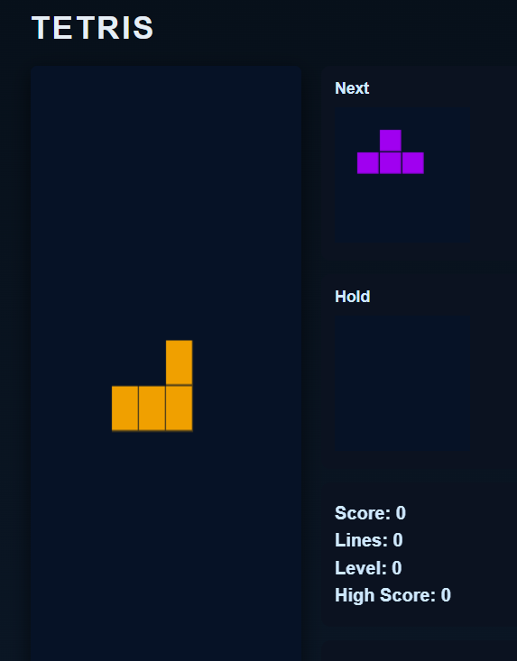

# 🎮 Tetris Game

A fully functional Tetris clone built using HTML, CSS, and JavaScript (Canvas API).  
Includes modern mechanics such as hold piece, next preview, hard drop, high-score saving, and full mobile controls.

---

## 📸 Demo / Screenshot

---

## ✨ Features
- Classic falling-block gameplay
- Rotations, soft drop, hard drop
- Hold piece system
- Next-piece preview
- Score, level, and line tracking
- Automatic increasing difficulty
- Mobile-friendly controls
- LocalStorage high-score saving
- Fully responsive UI (desktop + mobile)

---

## 🛠 Technologies Used
- HTML5 Canvas
- CSS3
- Vanilla JavaScript
- LocalStorage API
- Docker (optional)

---

## 🐳 Run with Docker

1. Build the Docker image:  
docker build -t tetris-game .

2. Run the container:  
docker run -d -p 8080:80 tetris-game  
(If using Python Dockerfile instead: docker run -d -p 8080:8000 tetris-game)

3. Play the game:  
http://localhost:8080

---

## 📥 Manual Installation (No Docker)

1. Clone the repository:  
git clone https://github.com/your-username/tetris-game.git

2. Open the folder:  
cd tetris-game

3. Run the game:  
Open index.html in your browser (no build tools needed)

---

## ▶ How to Play
Clear horizontal lines by stacking blocks.  
Speed increases with each level.

---

## 🎮 Controls

### Desktop
← / → : Move  
↓ : Soft drop  
↑ : Rotate  
Space : Hard drop  
C : Hold piece  
P : Pause  
R : Restart  

### Mobile
On-screen buttons for:  
Move left / right, Rotate, Soft drop, Hard drop, Hold

---

## 🧩 Developer Notes
- High scores saved via localStorage
- Canvas-based rendering engine
- Modular, clean JavaScript structure
- Adjust block size/colors in constants

---

## 🙏 Credits
Developer: **Mahamed**  
Assisted by: **ChatGPT**  
Inspired by the classic Tetris game

---

